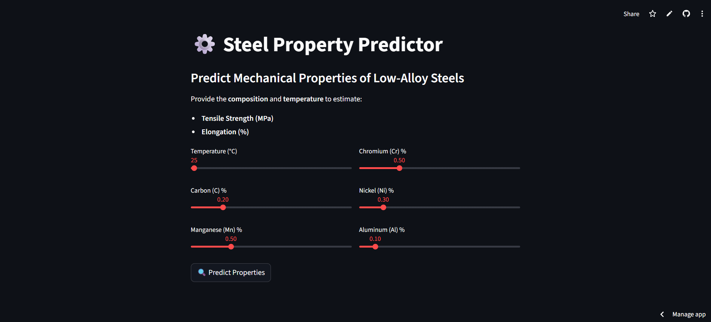

# Steel Properties Prediction

A machine learning project that predicts mechanical properties (tensile strength and elongation) of low-alloy steels based on their composition and temperature.

## Overview

This project implements two machine learning models to predict:
- Tensile Strength (using Ridge Regression with polynomial features)
- Elongation (using XGBoost Regressor)

The models take into account temperature and chemical composition (C, Mn, Cr, Ni, Al) to make accurate predictions of steel mechanical properties.

## Project Structure

```
steel-property-prediction/
├── data/               # Directory for datasets
├── models/            # Trained model files
│   ├── Ridge_TS_poly_final.joblib   # Tensile strength predictor
│   └── XGB_Elongation_final.joblib  # Elongation predictor
├── notebooks/         # Jupyter notebooks
│   ├── 01_exploratory_analysis.ipynb
│   └── 02_model_training.ipynb
├── app.py                    # Streamlit app for live predictions
├── requirements.txt
├── .gitignore
└── README.md
```
## Input Features

| Feature | Description | Unit |
|---------|------------|------|
| Temperature_C | Processing temperature | Celsius |
| C | Carbon content | wt% |
| Mn | Manganese content | wt% |
| Cr | Chromium content | wt% |
| Ni | Nickel content | wt% |
| Al | Aluminum content | wt% |

## Main Files

- **notebooks/01_exploratory_analysis.ipynb**  
  Jupyter notebook containing data analysis, feature relationships, and statistical insights.

- **notebooks/02_model_training.ipynb**  
  Complete modeling pipeline including feature engineering, model training, and evaluation.

- **models/Ridge_TS_poly_final.joblib**  
  Trained Ridge Regression model for tensile strength prediction.

- **models/XGB_Elongation_final.joblib**  
  Trained XGBoost model for elongation prediction.

- **/app.py**
  Streamlit application for interactive prediction interface.

## Models Overview

### Tensile Strength Predictor
- **Algorithm**: Ridge Regression with polynomial features
- **Key Features**: Temperature interactions and polynomial terms
- **Preprocessing**: Standard scaling

### Elongation Predictor
- **Algorithm**: XGBoost Regressor
- **Key Features**: Raw features with engineered interactions
- **Preprocessing**: Built into model pipeline

## Model Pipeline Details

1. **Data Preprocessing**
   - Feature scaling
   - Polynomial feature generation
   - Temperature interaction terms

2. **Model Training**
   - Cross-validation
   - Hyperparameter optimization
   - Model evaluation metrics

3. **Production Pipeline**
   - Automated preprocessing
   - Direct prediction capability
   - Integrated feature engineering

## Results Summary

| Target             | Model                  | R²      | RMSE     | MAE    |
|------------------- |---------------------- |---------|----------|--------|
| Tensile Strength   | Ridge + Polynomial     | 0.751   | 63.95    | 45.13  |
| Elongation_%       | XGBoost (tuned)       | 0.870   | 3.19     | 2.25   |

> The Ridge + Polynomial model achieved reasonable accuracy for predicting tensile strength, while the XGBoost model performed very well for elongation. Both models are suitable for low-alloy steel property predictions.

## Requirements

* **Python**: 3.8+ (3.8–3.11 recommended)
* **Core packages**: `numpy`, `pandas`, `scikit-learn`, `xgboost`, `matplotlib`, `seaborn`, `joblib`, `notebook`, `streamlit`

## Installation

1. Clone the repository:
```bash
git clone https://github.com/routh-vishal/steel-property-prediction.git
cd steel-property-prediction
```

2. Install dependencies:
```bash
pip install -r requirements.txt
```

## Usage

### Quick Prediction Example

```python
import joblib
import pandas as pd
import numpy as np
from sklearn.preprocessing import FunctionTransformer
from utils.feature_engineering import enhanced_features

# Load models
ridge_ts = joblib.load('models/Ridge_TS_poly_final.joblib')
xgb_elong = joblib.load('models/XGB_Elongation_final.joblib')

# Create input data
input_data = pd.DataFrame({
    'Temperature_C': [750],
    'C': [0.15],
    'Mn': [0.8],
    'Cr': [0.5],
    'Ni': [0.2],
    'Al': [0.1]
})

# Make predictions
tensile_strength = ridge_ts.predict(input_data)
elongation = xgb_elong.predict(input_data)

print(f"Predicted Tensile Strength: {tensile_strength[0]:.2f}")
print(f"Predicted Elongation: {elongation[0]:.2f}")
```
## 🎨 Streamlit App (Interactive UI)



You can interactively predict properties using sliders.

Run locally:

```bash
streamlit run app.py
```

Then open the displayed **local URL** (typically `http://localhost:8501/`) in your browser.

The app includes:

* Sliders for temperature and alloy composition
* Live predictions for **Tensile Strength (MPa)** and **Elongation (%)**
* Preloaded model pipelines

---

## Development Workflow

1. **Data Analysis**
   - Run `01_exploratory_analysis.ipynb`
   - Explore feature distributions and relationships
   - Analyze correlations

2. **Model Development**
   - Execute `02_model_training.ipynb`
   - Feature engineering pipeline
   - Model training and evaluation
   - Save optimized models

3. **Streamlit App**
   - Launch `app.py` for Streamlit predictions

## Credits

- Author: Vishal Routh
- Project Type: Materials Science ML Application
- Dataset: [Kaggle](https://www.kaggle.com/datasets/nitinsharma21/mechanical-properties-of-low-alloy-steel)
---